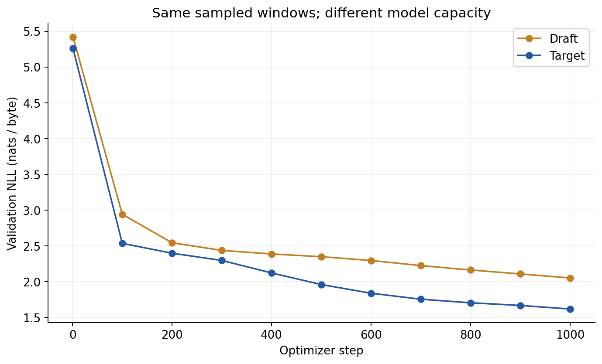
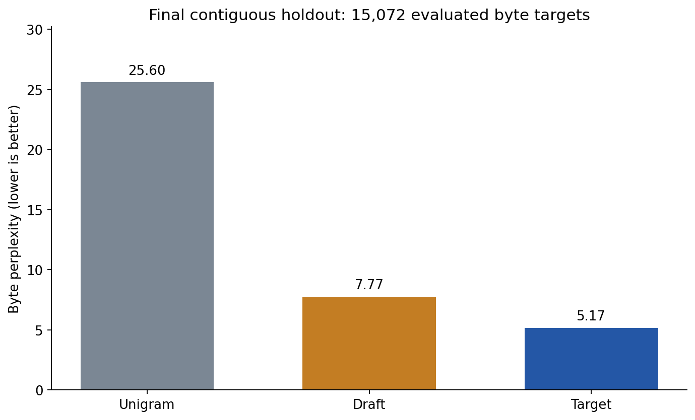
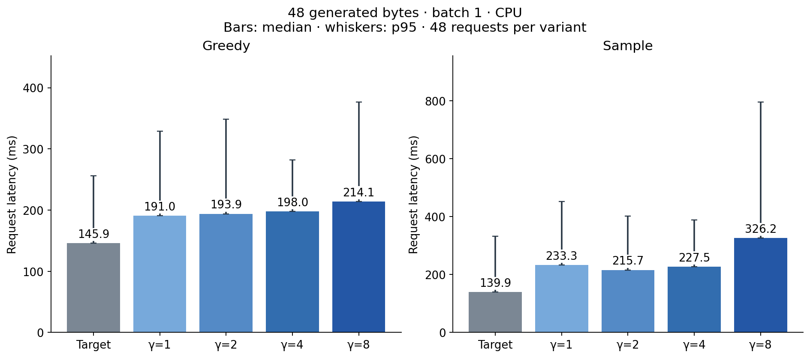
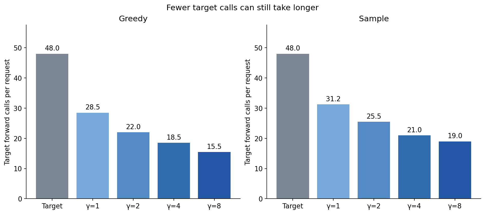
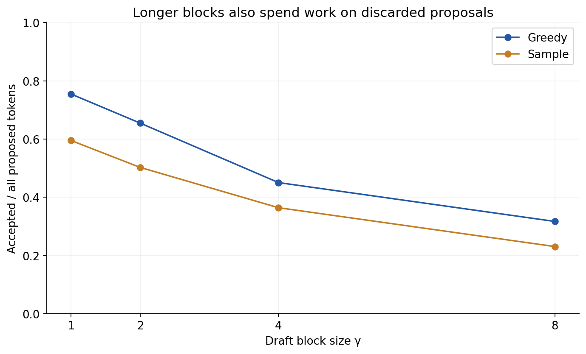
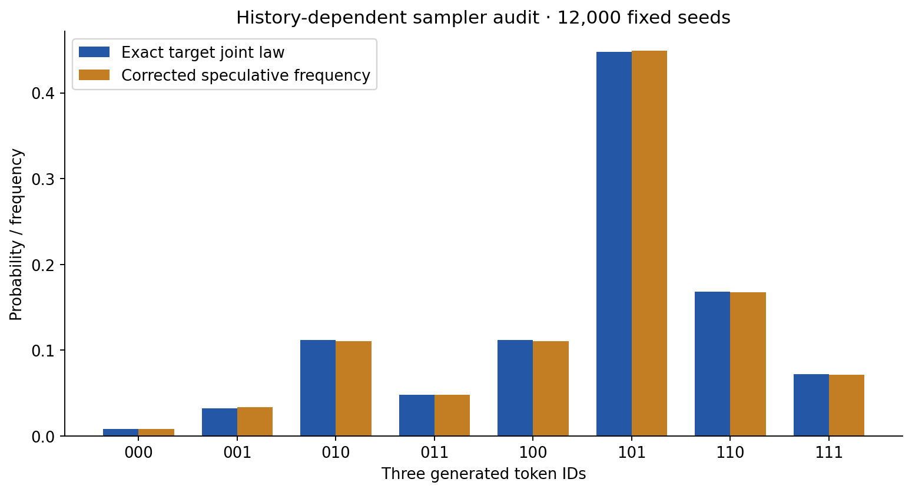

# SpecForge

A speculative decoding engine built from scratch in TensorFlow, with trained draft and target byte models, explicit KV rollback, and measured inference costs.

---

## Overview

The question is simple: **can a small draft model reduce inference time without changing the target model's decoding behavior?**

This repository makes the verification path inspectable. It implements causal attention, block KV consumption, speculative proposals, rejection correction and cache rollback directly, then tests them on two models trained on *Alice's Adventures in Wonderland*. The sampler is a separate NumPy module with a small backend interface, so it can be reused without the training pipeline.

* **Task:** Autoregressive byte prediction and distribution-preserving inference.
* **Corpus:** 151,095 UTF-8 bytes; fixed vocabulary of 256 byte IDs.
* **Target:** 311,616 parameters; holdout byte perplexity **5.1685**.
* **Draft:** 40,224 parameters; holdout byte perplexity **7.7708**.
* **Baseline:** Training-only unigram; holdout byte perplexity **25.5983**.
* **Main finding:** Fewer target forward calls did **not** produce a CPU latency improvement in this experiment.

These are small language models used to study inference architecture. They are not instruction-tuned LLMs, and their sampled text remains noisy.

---

## Key Results

### Validation checkpoint selection

Both roles were fixed before training. Each checkpoint was selected independently by the lowest validation negative log-likelihood; the holdout did not select the model sizes, random seed or draft block sizes.

| Model | Parameters | Selected Step | Validation NLL (nats/byte) | Byte Perplexity |
| :--- | ---: | ---: | ---: | ---: |
| Target | 311,616 | 1,000 | 1.6164 | 5.0350 |
| Draft | 40,224 | 1,000 | 2.0501 | 7.7685 |

### Final holdout evaluation

The contiguous holdout contains 15,110 bytes. Evaluation uses 157 nonoverlapping 96-byte input windows and **15,072 next-byte targets**, with context reset at each window. Byte perplexity is `exp(mean NLL)`; it is not directly comparable with word or subword perplexity.

| Model | NLL (nats/byte) ↓ | Byte Perplexity ↓ | Next-byte Accuracy ↑ |
| :--- | ---: | ---: | ---: |
| **Target** | **1.6426** | **5.1685** | **52.50%** |
| Draft | 2.0504 | 7.7708 | 41.95% |
| Unigram baseline | 3.2425 | 25.5983 | — |

Unigram accuracy was not recorded. The baseline uses training byte counts with Laplace smoothing (`α = 1`). Window NLL standard deviations are available in `runs/metrics.json`; they are descriptive variation across adjacent book passages, not cross-validation uncertainty.

### Greedy inference

Each request generates 48 bytes from a 16-byte held-out prefix. Values summarize 48 measured requests per variant: four fixed prompts, each repeated 12 times. Speed ratio is target-only median divided by speculative median; **below 1 means slower**.

| Decoder | Accepted / Proposed | Mean Target Calls | Median (ms) ↓ | p95 (ms) ↓ | Speed Ratio ↑ |
| :--- | ---: | ---: | ---: | ---: | ---: |
| Cached target only | — | 48.0 | **145.94** | 256.32 | 1.000× |
| Draft block 1 | 75.45% | 28.5 | 190.96 | 329.21 | 0.764× |
| Draft block 2 | 65.48% | 22.0 | 193.92 | 348.29 | 0.753× |
| Draft block 4 | 45.05% | 18.5 | 197.96 | 282.17 | 0.737× |
| Draft block 8 | 31.70% | 15.5 | 214.15 | 376.82 | 0.681× |

At block size 4, target calls fell **61.46%**, while median latency increased **35.65%**. Every proposal still requires a draft forward call; rejected suffixes waste work, and rollback, Python control flow and TensorFlow dispatch add costs. Call counts alone do not establish a speedup.

### Probability-corrected sampling

Same protocol, temperature `1.0`, fixed seed `123`. These observations measure this seed and prompt set; they do not average over a population of random seeds.

| Decoder | Accepted / Proposed | Mean Target Calls | Median (ms) ↓ | p95 (ms) ↓ | Speed Ratio ↑ |
| :--- | ---: | ---: | ---: | ---: | ---: |
| Cached target only | — | 48.0 | **139.91** | 332.83 | 1.000× |
| Draft block 1 | 59.50% | 31.25 | 233.26 | 451.80 | 0.600× |
| Draft block 2 | 50.26% | 25.50 | 215.74 | 401.90 | 0.649× |
| Draft block 4 | 36.42% | 21.00 | 227.47 | 389.00 | 0.615× |
| Draft block 8 | 23.08% | 19.00 | 326.18 | 795.84 | 0.429× |

The acceptance denominator includes all proposals, including later tokens discarded after an earlier rejection. The benchmark counts the complete request: both prefills, draft generation, target verification, probability operations, rollback and synchronized logit materialization. It excludes checkpoint loading and three warmup requests per prompt, mode and variant. Execution order rotates by trial and prompt and reverses on odd trials.

Measurements use CPU, float32, batch one, two TensorFlow intra-op threads and two inter-op threads, with oneDNN disabled. There are 480 timed requests. The wide p95 ranges show latency variability on this host; these results should not be extrapolated to GPUs, larger models, concurrent serving or long-context workloads.

---

## Architecture and Verification

| Component | Draft | Target |
| :--- | ---: | ---: |
| Decoder blocks | 1 | 3 |
| Model width | 48 | 96 |
| Attention heads | 4 | 4 |
| SwiGLU hidden width | 96 | 192 |
| Context | 96 bytes | 96 bytes |
| Token vocabulary | 256 | 256 |

Both models use learned byte and position embeddings, pre-normalized causal attention, SwiGLU feed-forward layers and an output projection tied to the input embedding. They were trained from random initialization using identical sampled windows, order, seed `42`, Adam learning rate `0.001`, global gradient clipping `1.0`, batch size `16` and 1,000 optimizer steps. Each model saw 1,536,000 sampled byte targets, with repeated sampling allowed. Their parameter counts and computation differ; this is not a compute-matched comparison. There are no pretrained weights or distillation targets.

### Speculative step

1. The draft proposes up to `γ` tokens autoregressively and retains its conditional distributions.
2. The target evaluates the proposed block in one causal forward pass. A pending correction or bonus token is included at the start of the next verification block, avoiding a separate target call for that token.
3. Greedy mode accepts a proposal only when its ID equals the target argmax at that position. At the first mismatch, it emits the target argmax.
4. Sampling mode accepts a proposed token `x` with probability `min(1, p(x)/q(x))`. At the first rejection, it samples from the normalized positive residual `max(p − q, 0)`. If every proposal is accepted and the output budget allows, it samples a bonus token from the target.
5. Both caches are truncated to the committed prefix. Rejected deeper hidden states never survive into the next round.

This follows [Leviathan et al., *Fast Inference from Transformers via Speculative Decoding*](https://proceedings.mlr.press/v202/leviathan23a.html); the algorithm is attributed to that work. The implementation, byte-model training and measurements here are specific to this repository.

### Correctness evidence

* **15 tests passed**, covering causal masking, block/full-prefix logits, rollback, gradient flow, checkpoint reload, request isolation, bounded generation, graph tracing, greedy equality and sampling correction.
* **2,560 greedy token comparisons passed** across 16 short requests and 16 requests that cross the context boundary, using the trained checkpoints and all four block sizes. Some prefixes and compared tokens overlap across these requests.
* When the initial prefix fills the context, target-only fallback matches the reference in both modes and makes zero draft calls. This fallback equality does not imply same-seed equality for general speculative sampling.
* A two-state history-dependent model has an exactly enumerated three-token joint distribution. Frequencies from **12,000 fixed seeds** satisfy the predetermined five-sigma bounds for all eight sequences. A separate closed-form residual-mass check recovers the target one-step probabilities.
* The saved holdout scores, raw sampled bytes, benchmark IDs/statistics and source bytes are independently replayed by `verify.py`.

Greedy comparisons test actual token equality on these cases. Sampling correction preserves the target conditional law in ideal arithmetic; finite checks do not prove all possible neural outputs correct. Different floating-point evaluation paths can affect nearly tied logits. Speculative sampling and target-only sampling generally consume random numbers differently, so their outputs need not match at the same seed.

### Context boundary

Learned positions reset when the latest 96-byte window shifts. Cached deeper states depend on removed context and cannot simply be sliced and reused. SpecForge re-prefills the exact latest window and uses target-only generation after reaching the limit. The main timing requests remain inside this window; separate correctness requests exercise the fallback. There is no long-context speedup claim.

---

## Data Summary and Error Analysis

* **Source:** [Lewis Carroll, *Alice's Adventures in Wonderland*, Project Gutenberg ebook 11](https://www.gutenberg.org/ebooks/11).
* **License:** The source identifies the book as public domain in the USA. The corpus is referenced rather than redistributed.
* **Preparation:** Strip the exact Gutenberg boundary markers and outer whitespace, normalize CRLF to LF, append one final LF and encode as UTF-8. No fitted tokenizer or vocabulary.
* **Splits:** Contiguous 120,876 / 15,109 / 15,110 bytes for training / validation / test. No input/target window crosses a split. Recurring phrases are retained, so this is a within-book evaluation.
* **Quality checks:** All transformed bytes were compared with the complete public download. Raw source and transformed corpus SHA-256 hashes are recorded in `data/manifest.json`.

`runs/error_analysis.json` retains the five highest-NLL target windows, their exact input bytes, body offsets and scores. Three are adjacent verse passages; the remaining two include courtroom dialogue with punctuation and emphasis. Their NLLs range from **2.1026 to 2.2016** nats/byte, compared with the overall **1.6426**. These examples suggest where the model struggles; they do not isolate a causal explanation for its errors.

The included fixed-prompt samples show misspellings, repetition and broken word boundaries. The target sample also contains invalid UTF-8; `sample.bin` preserves the actual generated bytes, while `sample.txt` uses replacement characters for display. Teacher-forced byte prediction scores therefore should not be mistaken for fluent free-running generation or semantic reasoning ability.

---

## Visualizations

| Validation learning curves | Holdout model comparison |
| :---: | :---: |
|  |  |

| CPU request latency | Target forward calls |
| :---: | :---: |
|  |  |

| Proposal acceptance | History-dependent distribution check |
| :---: | :---: |
|  |  |

---

## Repository Structure

| Path | Contents |
| :--- | :--- |
| `specforge/model.py` | TensorFlow decoder, block KV operations and backend adapter. |
| `specforge/decoding.py` | Framework-independent verification, residual correction and rollback. |
| `generate.py` | CLI for target-only or speculative generation using included checkpoints. |
| `prepare.py`, `study.py` | Hash-checked corpus preparation and fixed-budget training. |
| `benchmark.py` | Counterbalanced timing and saved output IDs. |
| `sampler_check.py` | Exact finite-model law and fixed-seed frequency audit. |
| `verify.py`, `artifacts.py` | Score/output/source replay and explicit publication inventory. |
| `plots.py`, `figures/` | Plots rendered from executed measurements. |
| `runs/draft/`, `runs/target/` | Configurations, weights, holdout window losses and raw samples. |
| `runs/metrics.json` | Validation/holdout scores, controls and environment. |
| `runs/benchmark.json` | All 480 timing observations, summaries, prompts, IDs and call counts. |
| `runs/training_starts.npy`, `runs/training_history.csv` | Actual window schedule and training observations. |
| `runs/error_analysis.json`, `runs/sampler_check.json` | Error windows and sampler diagnostics. |
| `data/manifest.json`, `audit.json` | Source attribution, execution checks and artifact hashes. |
| `tests/`, `USAGE.md` | Correctness tests, integration contract and CLI usage. |

See [USAGE.md](USAGE.md) for using the checkpoints and integrating the sampler. Model generation needs no external API, paid LLM service or corpus download.

## Attribution

Built for Saud Alotaibi with AI-assisted implementation, experiment execution and documentation. Every published metric comes from the executed files in this repository. Human review is not claimed. The software is MIT licensed; the external corpus and speculative decoding research retain their own attribution.
